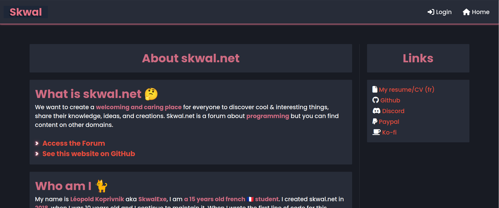

# Skwal Dot Net
🌐 Remake of skwal.net with more modern technologies, goodbye PHP, hello Python and Django

Skwal.net is not only my personal website but also a vibrant platform for programming enthusiasts to showcase their projects and share their passions. It is also a place where I can share my knowledge and my projects with the world. 



# Local Setup for Development

### Install the Requirements

```bash
pip install -r requirements.txt
```

### Create a .env file

```bash
cp .env.sample .env
# and edit it if necessary
vim .env
```

### Run the server

```bash
python3 skwal_net/manage.py runserver
```

